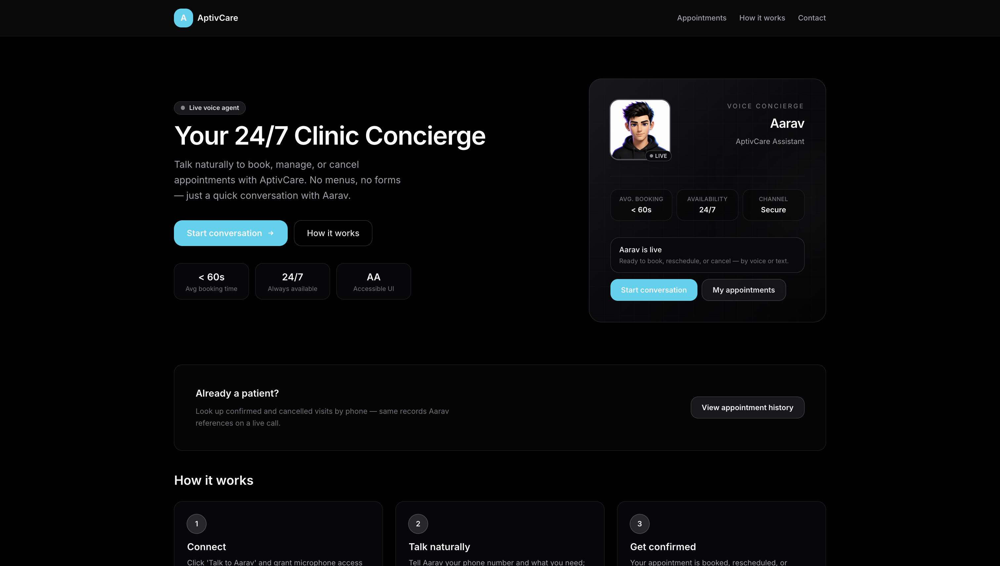
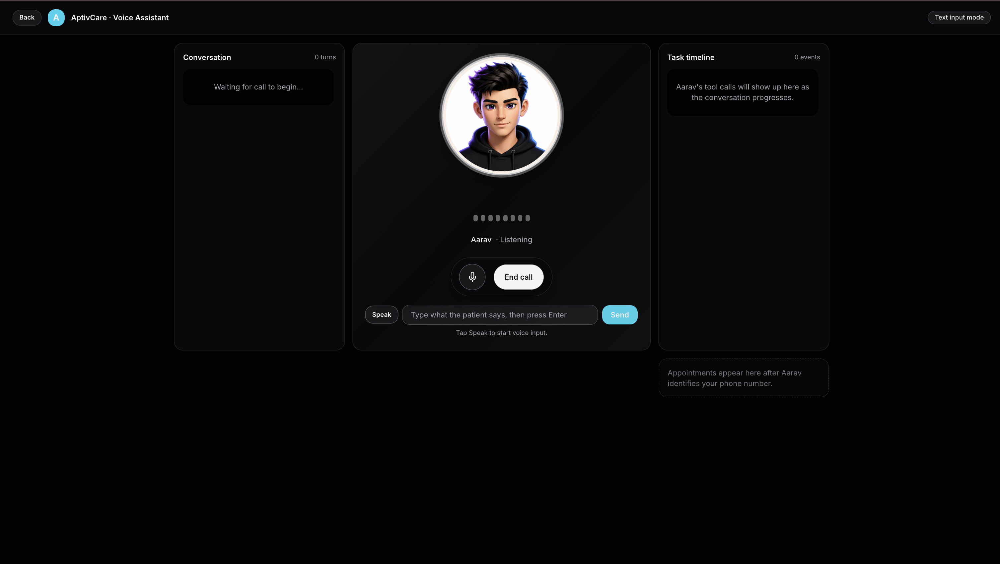
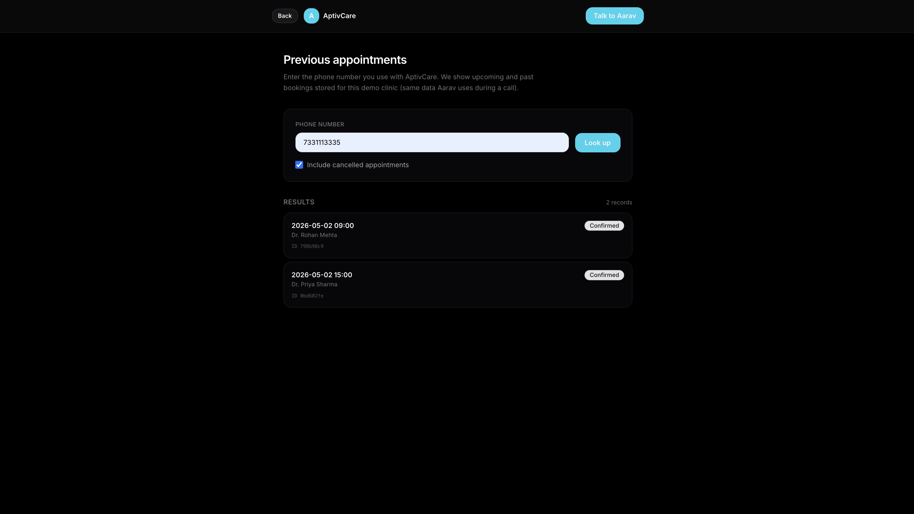

# AptivCare Assistant

Voice-first AI front desk for a clinic: patients talk (or type) with **Aarav**, who can identify them by phone, list slots, and book / reschedule / cancel appointments. The stack is a **FastAPI** backend with SQLite, optional **LiveKit** WebRTC, and a **React + Vite** frontend.







---

## What this application does

| Area | Description |
|------|----------------|
| **Voice & chat** | Browser session connects to the API; default path uses WebSocket PCM streaming with tool-calling (Deepgram / Cartesia when configured, OpenAI fallbacks). Optional LiveKit mode uses WebRTC when credentials are valid. |
| **Agent** | LLM-driven assistant with tools: identify user, fetch slots, book / modify / cancel appointments, end conversation. |
| **Data** | SQLite stores users, appointments, sessions, and post-call summaries. |
| **Web UI** | Landing page, live call layout (transcript, avatar, tool timeline), call summary, and a **phone lookup** page for past appointments (`/appointments`). |

---

## Repository layout

```
├── backend/          # FastAPI, LiveKit agent worker, WebSocket voice, SQLite
│   ├── requirements.txt
│   └── .env.example
├── frontend/         # React 18 + Vite + Tailwind
│   ├── package.json
│   └── .env.example
├── docs/screenshots/ # UI images for this README
├── SECURITY.md       # Secrets and safe publishing notes
└── README.md         # This file
```

---

## Prerequisites

- **Node.js** 18+ (for the frontend)
- **Python 3.11+** (backend; match LiveKit Agents docs if you change versions)
- Accounts / keys as needed:
  - [OpenAI](https://platform.openai.com/) API key (required for LLM / summaries; STT-TTS fallbacks)
  - [LiveKit Cloud](https://cloud.livekit.io/) (optional; for WebRTC `/call` path)
  - [Deepgram](https://deepgram.com/) / [Cartesia](https://cartesia.ai/) (optional; preferred realtime pipeline)

---

## Dependencies

| Layer | Install command |
|--------|------------------|
| **Backend** | `cd backend && python -m venv .venv && source .venv/bin/activate` then `pip install -r requirements.txt` |
| **Frontend** | `cd frontend && npm install` |

Pinned versions live in `backend/requirements.txt` and `frontend/package-lock.json`.

---

## How to run (local development)

### 1. Configure secrets (never commit real `.env` files)

```bash
cp backend/.env.example backend/.env
cp frontend/.env.example frontend/.env
```

Edit **`backend/.env`**: set at minimum `OPENAI_API_KEY`. For LiveKit browser calls, set `LIVEKIT_API_KEY`, `LIVEKIT_API_SECRET`, and `LIVEKIT_URL`. For CORS, align `FRONTEND_ORIGIN` with the URL you open in the browser (e.g. `http://localhost:5173`).

Edit **`frontend/.env`** if the API is not on `http://localhost:8000` (`VITE_API_URL`).

See **[SECURITY.md](SECURITY.md)** before pushing to GitHub.

### 2. Start the API

```bash
cd backend
source .venv/bin/activate   # Windows: .venv\Scripts\activate
python main.py
```

Server listens on **http://0.0.0.0:8000**. Check **http://localhost:8000/api/health**.

### 3. Start the web app

```bash
cd frontend
npm run dev
```

Open **http://localhost:5173**. Use **Start conversation** for the WebSocket path, or `/call` for LiveKit if configured.

### 4. Production build (frontend only)

```bash
cd frontend
npm run build
npm run preview   # optional local preview of dist/
```

---

## API quick reference

| Endpoint | Purpose |
|----------|---------|
| `GET /api/health` | Liveness and configuration flags |
| `POST /api/sessions` | LiveKit session + token |
| `POST /api/sessions/websocket-voice` | WebSocket-voice session id + URL |
| `GET /api/appointments?phone=…` | List appointments for a phone |
| `GET /api/sessions/{id}/summary` | Poll post-call summary |

Interactive docs: **http://localhost:8000/docs** when the backend is running.

---

## Security checklist for GitHub

- [ ] Confirm `.env` files are **not** tracked (`git status`).
- [ ] Rotate any key that ever appeared in a public place.
- [ ] Do not commit `backend/data/*.db` with real PHI; `.gitignore` excludes local DB artifacts.
- [ ] Read **[SECURITY.md](SECURITY.md)**.

---

## License

Use and modify for learning or demos; add a proper license file before redistribution if you need explicit terms.
